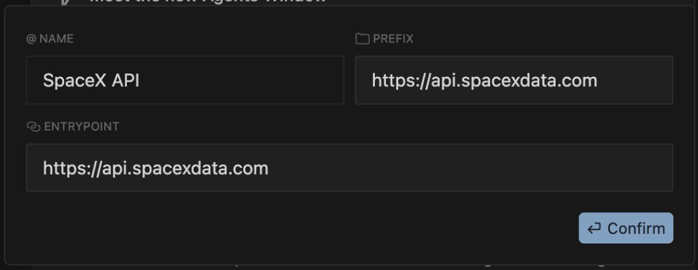

# TP 1 — La doc au service du contexte (SpaceX Launches)

## Objectif

Construire une mini-app web **SpaceX Launches** en HTML/JS/`fetch`, en s'appuyant sur
`@Docs` et un serveur MCP pour consommer l'**API SpaceX à jour** plutôt que de
se fier à la seule mémoire du modèle.

## Prérequis

- Cursor installé et connecté
- Un navigateur web moderne
- Aucun build : on ouvre directement le fichier `index.html`
- API publique : `https://api.spacexdata.com` (aucune clé requise)

## Exercice 1 — Préparer le contexte avec la doc

Avant de coder, on **donne la doc** à Cursor.

1. Ouvrez les **Settings** de Cursor (`Cmd+,`), section **Indexing & Docs**.
2. Ajoutez une source de documentation avec les valeurs suivantes :

| Champ | Valeur |
|-------|--------|
| **@ Name** | `SpaceX API` |
| **Prefix** | `https://api.spacexdata.com` |
| **Entrypoint** | `https://api.spacexdata.com` |



3. Ouvrez un nouveau chat Agent (`Cmd+I`) et référencez la doc via `@Docs` → **SpaceX API**.
4. Demandez à l'agent de **confirmer les endpoints** à utiliser :

```text
Quels endpoints de l'API SpaceX (v4/v5) permettent de récupérer
le dernier lancement et la liste des lancements récents ?
```

> **Note** : comparez la réponse **avec** et **sans** la doc dans le contexte.
> Sans doc, le modèle peut proposer des endpoints périmés.

## Exercice 2 — Scaffolder l'app

Demandez à l'agent de créer la base de l'app.

```text
Crée une page index.html autonome (HTML + JS vanilla, sans framework, sans build)
qui appelle https://api.spacexdata.com/v5/launches/latest avec fetch
et affiche : nom de la mission, date, et le succès du lancement.
```

Vérifiez que le fichier s'ouvre dans le navigateur et affiche le dernier lancement.

## Exercice 3 — Enrichir avec la liste des lancements

```text
Ajoute un appel à /v4/launches pour afficher les 10 derniers lancements
sous forme de cartes (nom, date formatée en français, statut).
Gère le cas où une donnée est absente.
```

> **Note** : utilisez `@Docs` ou ajoutez l'URL de l'API si l'agent hésite sur le format de la réponse.

<br>

## Checklist de validation

- [ ] J'ai ajouté la doc de l'API dans **Indexing & Docs** et l'ai référencée via `@Docs`
- [ ] `index.html` affiche le **dernier lancement** SpaceX
- [ ] La liste des **10 derniers lancements** s'affiche en cartes
- [ ] Les dates sont formatées en français et les cas manquants gérés
- [ ] J'ai constaté la différence de qualité **avec / sans** doc dans le contexte
